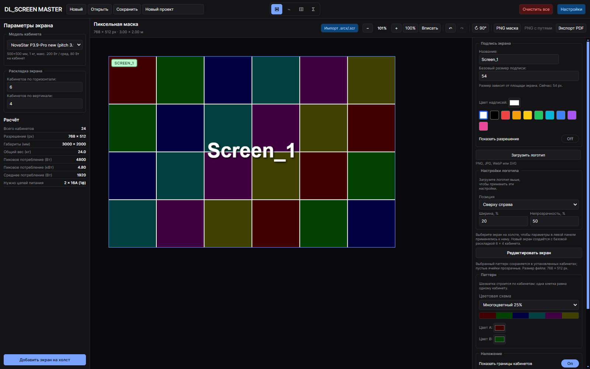
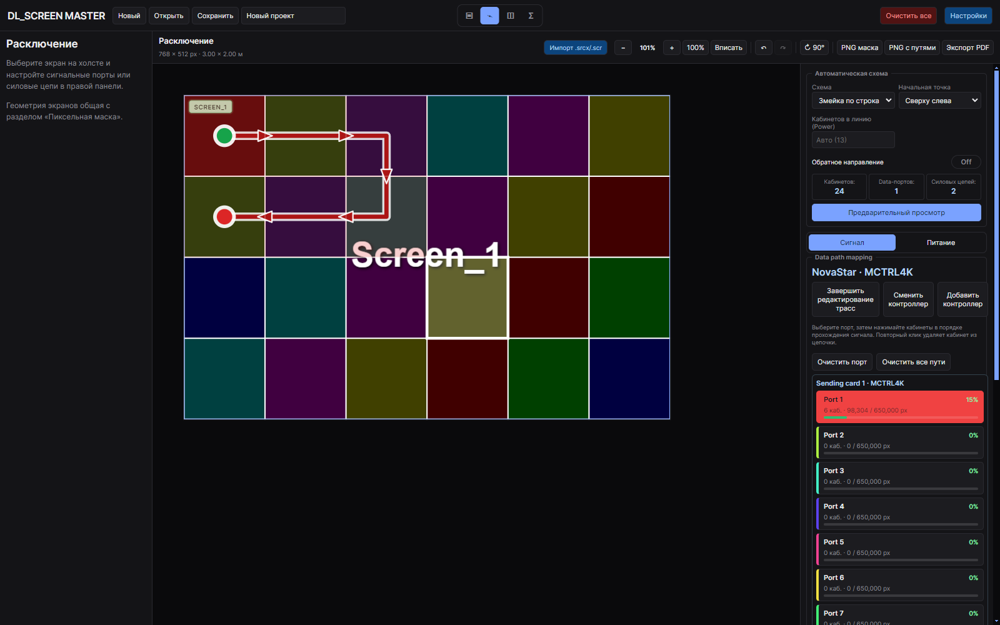
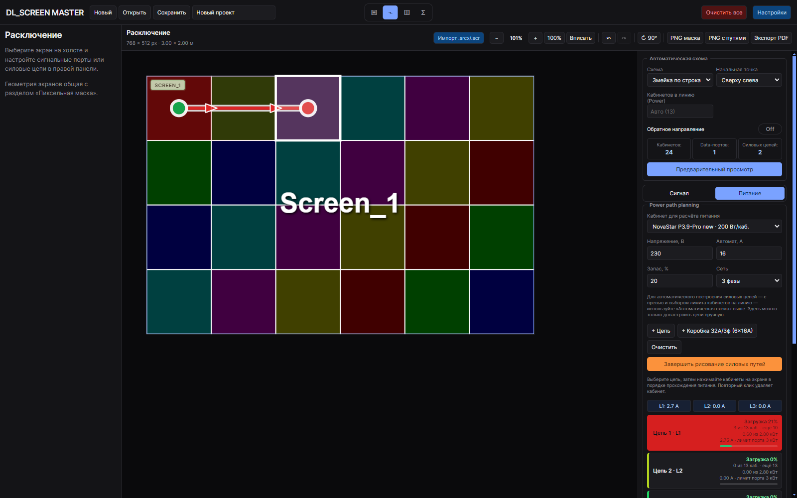
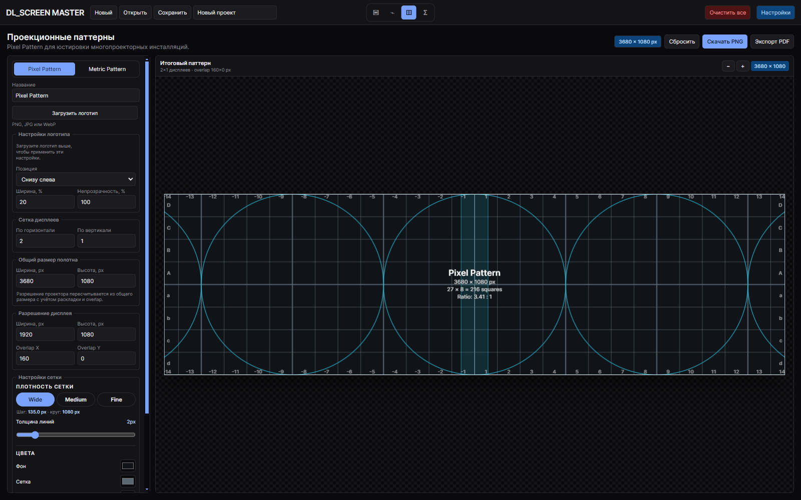
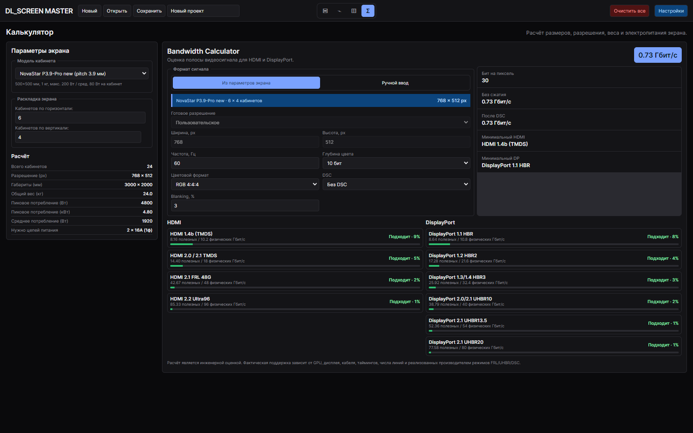
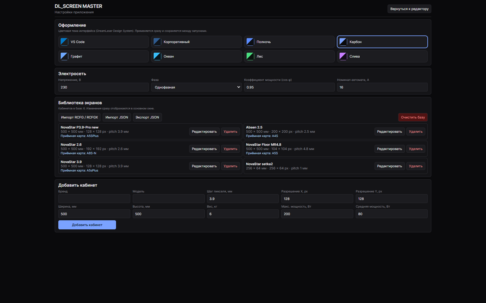

# DL_SCREEN MASTER

Desktop-приложение (Electron + React + TypeScript) для проектирования
LED-экранов: раскладка кабинетов, пиксельные маски, сигнальные и силовые
схемы подключения, проекционные паттерны для мультипроекторных инсталляций
и инженерные калькуляторы.



## Возможности

- **Пиксельная маска** — раскладка экрана из кабинетов с реальным
  разрешением, паттерны (шахматка, полосы, градиент, сетка, заливка),
  несколько экранов на одной рабочей области с перетаскиванием,
  примагничиванием краёв, поворотом и выравниванием. Подпись экрана,
  логотип, выбор цветов и границ кабинетов.
- **Расключение (Wiring)** — ручное и автоматическое построение
  сигнальных (data path) и силовых (power path) схем:
  - автогенератор маршрутов змейкой, по строкам/колонкам или от центра,
    с выбором стартового угла и графическим предпросмотром перед
    применением;
  - контроль ёмкости портов (пиксели/кабинеты на порт) и перегрузки
    силовых цепей с распределением по фазам L1/L2/L3;
  - добавление контроллера NovaStar (MCTRL4K/660/660 Pro, H9, H15),
    смена контроллера и **добавление ещё одного контроллера**, когда
    портов текущего не хватает — уже назначенные трассы сохраняются;
  - быстрое добавление силовой коробки **3ф 32А → 6×16А** одним
    нажатием, с распределением цепей по фазам.
- **Импорт NovaStar** — `.srcx`/`.scr` (сцена целиком, с автоматическим
  сопоставлением кабинетов с базой пресетов) и `.rcfg`/`.rcfgx`
  (отдельный кабинет).
- **Проекционные паттерны** — генератор Pixel Pattern (сетка, окружности,
  перекрытие) и Metric Pattern для юстировки мультипроекторных
  инсталляций, с сеткой дисплеев, overlap и экспортом в PNG/PDF.
- **Калькулятор** — вес, габариты, потребление и рекомендуемое число
  силовых цепей экрана; Bandwidth Calculator для HDMI 1.4b–2.2 и
  DisplayPort 1.1–2.1 (RGB/YCbCr, глубина цвета, blanking, DSC).
- **Экспорт** — PNG-маска (объединённая и по отдельности для нескольких
  выделенных экранов), PNG со схемой сигнального пути, PDF-отчёт по
  проекту со сводной таблицей, масками и схемами подключения.
- **Проекты `.dlscreen`** — сохранение и открытие через Electron IPC;
  библиотека пользовательских кабинетов хранится отдельно от проекта.
- **Темы оформления** — 8 цветовых тем DreamLaser Design System,
  применяются мгновенно и сохраняются между запусками.

## Скриншоты

| Сигнальные пути и контроллеры | Силовые цепи |
|---|---|
|  |  |

| Проекционные паттерны | Калькулятор |
|---|---|
|  |  |

<details>
<summary>Настройки и темы оформления</summary>



</details>

## Установка и запуск

```bash
npm install
npm run dev      # запуск в режиме разработки
```

```bash
npm run build     # production-сборка renderer/main
npm run package   # сборка установщика (electron-builder)
```

## Документация

Подробное руководство пользователя — в [docs/USAGE.md](docs/USAGE.md):
база кабинетов, работа с масками, импорт NovaStar, построение сигнальных
и силовых схем, проекционные паттерны, калькулятор и экспорт.

## Структура проекта

```
src/
  main/            — Electron main process (окно, IPC, файловые диалоги)
  renderer/        — React UI
    components/    — редактор масок, расключение, калькуляторы
    sections/      — проекционные паттерны
  shared/          — общий код: типы данных и бизнес-логика расчётов
                     (не зависит ни от Electron, ни от React)
docs/
  screenshots/      — изображения для README
  USAGE.md          — руководство пользователя
```
